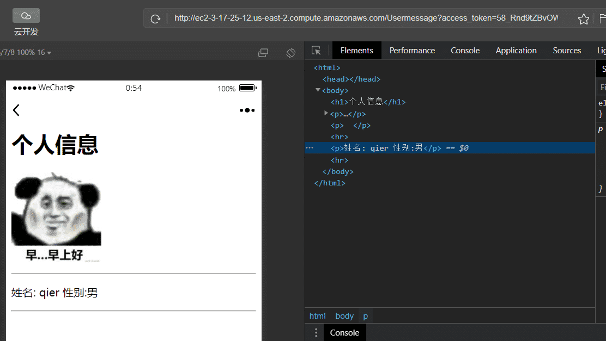

#  微信授权

> 这个demo，实现的效果就是使用微信测试账号对网页进行授权

## 使用方式

在index.js文件中，将对应常量内容填充完毕即可。

- AppID,是微信开发平台中的APPID，不是微信小程序中的APPID
- AppSecret
- return_uri

## 运行方式

安装依赖

```javascript
npm install 
```

运行程序

```javascript
node index.js
```

## 结果展示



参考链接：

- https://cloud.tencent.com/developer/article/1677630
- https://cloud.tencent.com/developer/article/1703167